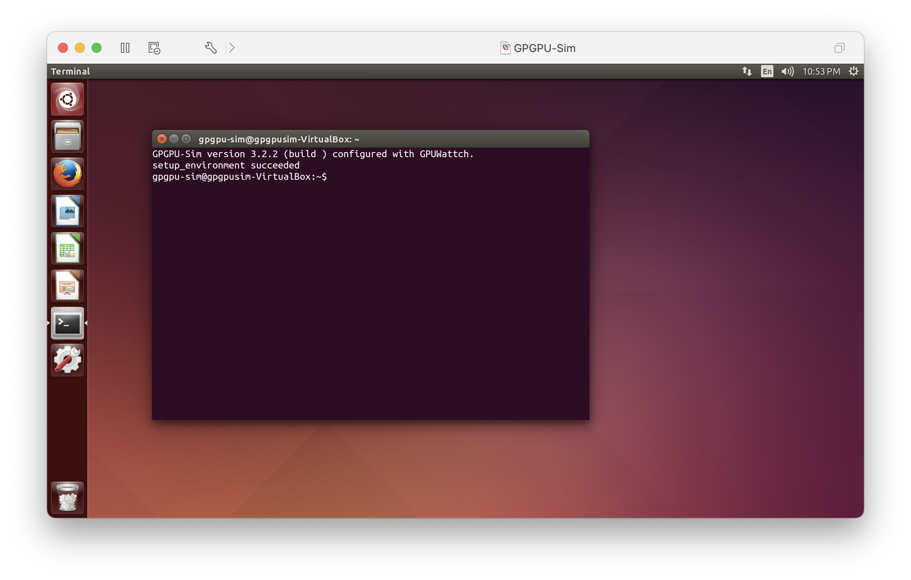
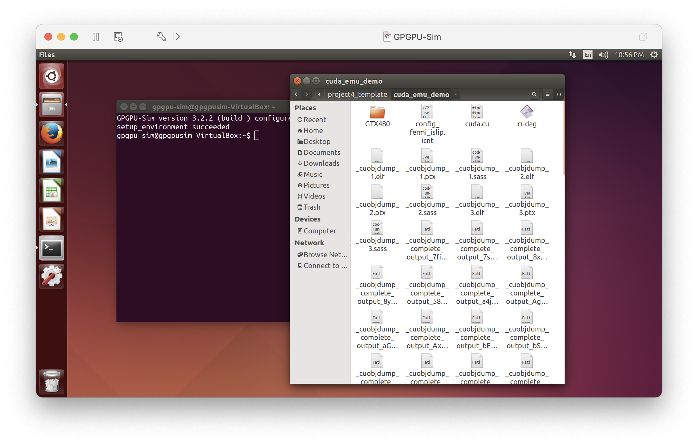
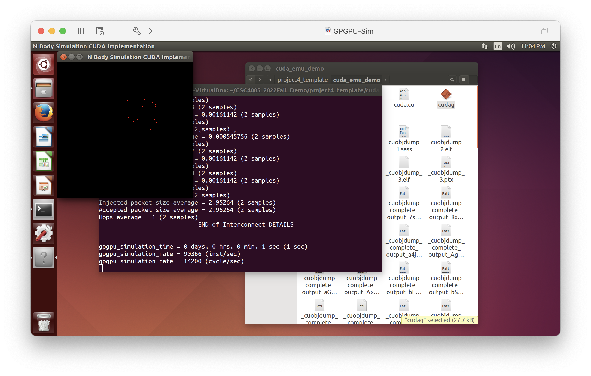
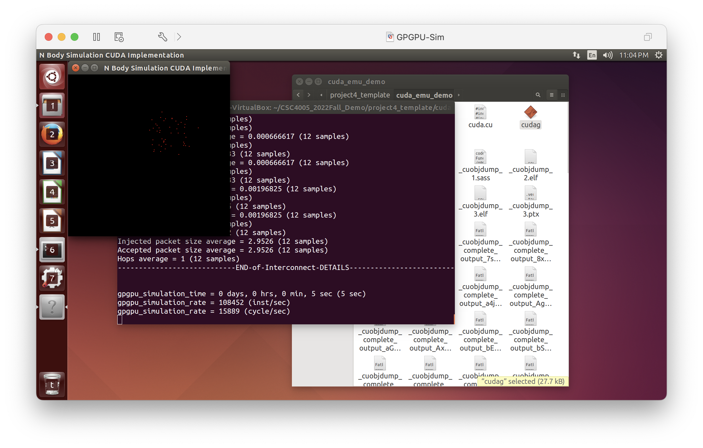
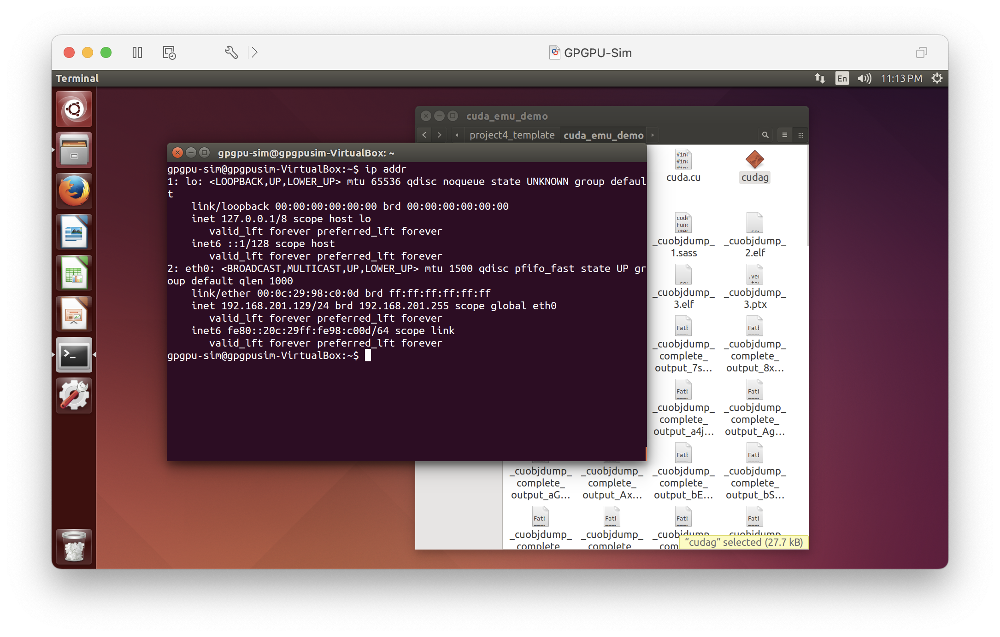
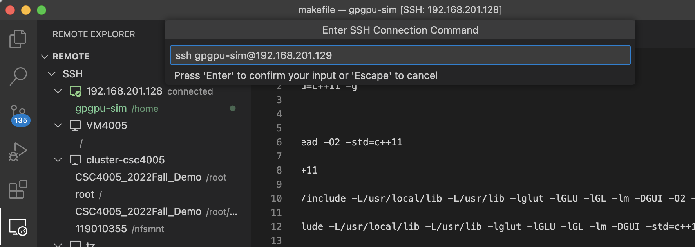

# CSC4005 CUDA Emulator Manual

We have prepared a CUDA Emulator Virtual Machine for you. You can **emulate CUDA or CUDA-GUI program** on your personal computer (**without Nvidia GPU!**). 

(Arm64 chips like Apple M1 M2 are not supported).


Reference: https://github.com/gpgpu-sim/gpgpu-sim_distribution

 
<br/>
<br/>
<br/>


# Setting Up Virtual Machine

## 1. Download CUDA Emulator VM.

https://cowtransfer.com/s/b2339270c9224a


## 2. Import.

Both VMWare and VirtualBox are OK.

If it says `importing failed`, please click `Retry`.

If your host machine has 8 CPU cores, please allocate 2 cores to this VM. 

If your host machine has 4 CPU cores, please try to allocate 2 cores to this VM.

## 3. Power on.

If you find it black, just wait for a few seconds (it should not be black for several minutes). If so, please report.


<br/>
<br/>
<br/>

# Usage

**Username: gpgpu-sim**

**Password: gpgpu-sim**

### Step 1: Open terminal.



Once you see the prompt saying `setup_environment succeed`, you can directly run your CUDA-GUI program with only CPU.


## Step 2: Compile your **CUDA-GUI** program

Here we provide a cuda implementation for CSC4005 Project 3 for demonstration.



`git clone` the latest version of `CSC4005_Demo`. Go to `project3_template/cuda_emu_demo`. (**Notice that you must compile and run your program inside this directory, because it contains configuration of GTX480 GPU.**). You will find `cuda.cu` .

First go to this directory,

```bash
cd $Somewhere/CSC4005_2022Fall_Demo/project4_template/cuda_emu_demo
```

Then compile your CUDA-GUI program:

```bash
nvcc cuda.cu -o cudag -lglut -lGLU -lGL -lm -O2 -DGUI
```

Notice that `nvcc` and `gcc` on this VM does not support c++11, so you should avoid using newest features when you debug your CUDA code (like `chrono`).

Then you will see `cudag` in this directory.


## Step 3: Run

Run it as you run a regular CUDA application:

```bash
./cudag $n_body $n_iterations
```

Notice that the performance of CPU is relatively poor, so you should consider using small `$n_body`. Here we use

```bash
./cudag 50 100
```

Then you would wait a few seconds when the program is initializing.



Then you will see the bodies moving.



Another information is, there will be debugging information displaying in terminal, it is not a signal of error.

## Step 5: Notice

As mentioned by authors of gpgpu-sim, some cuda api are not available for gpgpu-sim like `syncthreads()`. Please pay attention.


## Step 6: Switch to Project 4

For project 4, you need to copy `CSC4005_2022Fall_Demo/project4_template/src/cuda.cu` to `CSC4005_2022Fall_Demo/project4_template/cuda_emu_demo` first.

Then you make sure you have removed everything about `chrono` in your cuda script, as well as any other new features in `C++11`. 

Then you can compile your CUDA-GUI program by using


```bash
nvcc cuda.cu -o cudag -lglut -lGLU -lGL -lm -O2 -DGUI
```

Then you run your CUDA-GUI program in **GUI Desktop** rather then VSCode by 


```bash
./cudag $size
```


## Update Dec 4, 2022

Dear all, due to some reports about CUDA emulator, we suggest you to change the following parameters when you run CUDA GUI:

1. change macro `resolution` to `100`.

2. change macro `fire_size` to `30`.

3. change command line arg `size` to `100`.

Even we choose a small problem size, the rendering speed of CUDA emulator is still low (about `5s` to `10s` per frame). 


<br/>
<br/>
<br/>


# VSCode Remote to VM

This requires some fussy operations.

1. First, you need to know IP address of this VM.

Open a terminal, type `ip addr` to show ip addresses.



Please notice `2:eth0`. Remember the IP address in `2:eth0`. In my case, it is, `192.168.201.129`. 


2. Open VSCode on your host machine



Choose Remote tab, and add a new server.

Type `ssh gpgpu-sim@192.168.201.129` (in my case, replace IP address with your own). 

Then save and connect.

Then input your password following prompt.

Then you open folder `/home/gpgpu-sim/`.

Then you will have a good coding experience.


3.***This method is applicable for CSC4005 VM as well.***


<br/>
<br/>
<br/>


Any problems please email 119010355@link.cuhk.edu.cn.

Hope it is helpful.

Bokai XU
