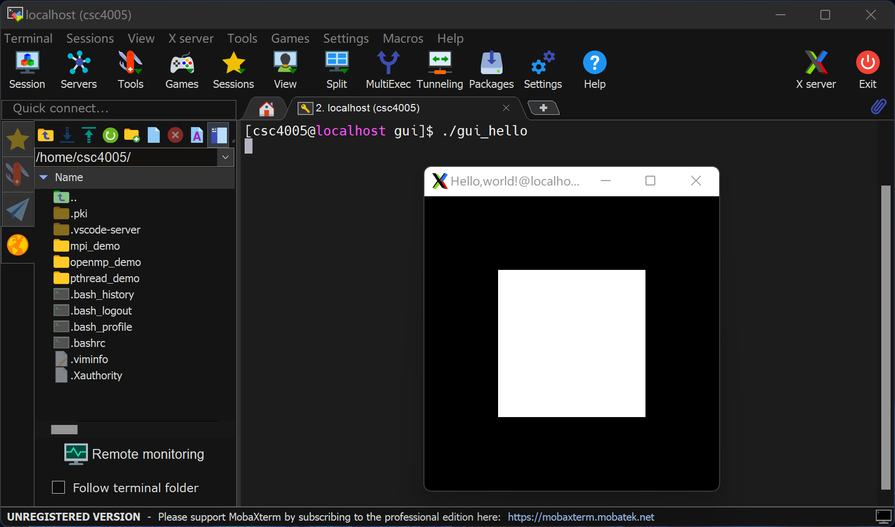

# Compile

```bash
cd /home/csc4005/gui_demo
g++ -I/usr/include -L/usr/local/lib -L/usr/lib -lglut -lGLU -lGL -lm gui_hello.cpp -o gui_hello
```

# Run

## Windows

You need MobaXterm

```bash
cd /home/csc4005/gui_demo
./gui_hello
```

Output should be like:




# Environment & Libraries

This code use Mesa (an implementation of OpenGL) for GUI.

```bash
sudo yum install mesa*
```

We also need a helper library called Glut.

```bash
nash yum list *glut*
```

