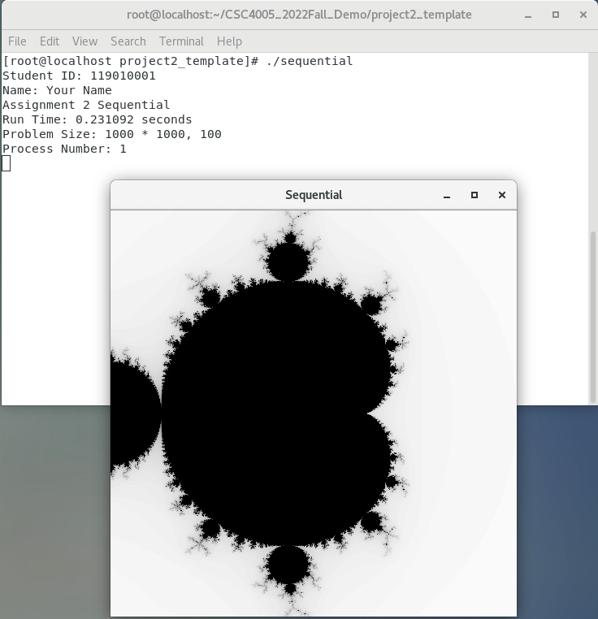

# CSC4005 Project 2 Template


This code can run on CSC4005 VM (both arm64 and x86_64 version, both command line mode and GUI mode). 

This code can also run on HPC cluster (only command line mode, no GUI, see instructions below). 





# Description

The template includes the following component:

1. Sequential version is completed for your reference.
2. MPI version and pthread version are not completed.

To do parallelization, you have multiple choices. You are encouraged to use some brand new method to partition the data. 


Header files: `asg2.h`. Common functions and variables are included in `asg2.h` with some explaination.


Source code: `sequential.cpp`, `pthread.cpp`, `mpi.cpp`.


# Getting started

Don't worry! Please read `asg2.h` and `sequential.cpp` to understand the whole picture before you write your own implementation. (Sequential version is completed, for your reference.)

Don't worry about the mathematics part. We have prepared a completed atom function for computing the color given a point! Your only job in this project is to smartly partition all data to all workers.

```c++
void compute(Point* p) {
	/* 
	Give a Point p, compute its color.
	Mandelbrot Set Computation.
	It is not necessary to modify this function, because it is a completed one.
	*** However, to further improve the performance, you may change this function to do batch computation.
	*/

	Compl z, c;
	float lengthsq, temp;
	int k;

	/* scale [0, X_RESN] x [0, Y_RESN] to [-1, 1] x [-1, 1] */
	c.real = ((float) p->x - X_RESN / 2) / (X_RESN / 2);
	c.imag = ((float) p->y - Y_RESN / 2) / (Y_RESN / 2);

	/* the following block is about math. */ 

	z.real = z.imag = 0.0;
    k = 0;

	do { 
		temp = z.real*z.real - z.imag*z.imag + c.real;
		z.imag = 2.0*z.real*z.imag + c.imag;
		z.real = temp;
		lengthsq = z.real*z.real+z.imag*z.imag;
		k++;
	} while (lengthsq < 4.0 && k < max_iteration);

	/* math block end */ 

	p->color = (float) k / max_iteration;

}
```

# Dependencies

<strong>No extra package is needed on VM or cluster.</strong>

If you want to DIY environment, run:

```sh
apt-get install *mesa* *glut*
```
or 
```sh
yum install *mesa* *glut*
```


# Compile

NOTE: 

1. All compilation can be finished on VM.

2. HPC cluster only supports compilation of non-GUI versions.

### Sequential without GUI (completed, for reference)
```sh
g++ sequential.cpp -o seq -O2 -std=c++11
```

### Sequential with GUI (completed, for reference)
```sh
g++ -I/usr/include -L/usr/local/lib -L/usr/lib -lglut -lGLU -lGL -lm sequential.cpp -o seqg -DGUI -O2 -std=c++11
```

### MPI without GUI (finish `#TODO` by yourself)
```sh
mpic++ mpi.cpp -o mpi -std=c++11
```

### MPI with GUI (finish `#TODO` by yourself)
```sh
mpic++ -I/usr/include -L/usr/local/lib -L/usr/lib -lglut -lGLU -lGL -lm mpi.cpp -o mpig -DGUI -std=c++11
```


### pthread without GUI (finish `#TODO` by yourself)
```sh
g++ pthread.cpp -lpthread -o pthread -O2 -std=c++11
```

### pthread with GUI (finish `#TODO` by yourself)
```sh
g++ -I/usr/include -L/usr/local/lib -L/usr/lib -lglut -lGLU -lGL -lm -lpthread pthread.cpp -o pthreadg -DGUI -O2 -std=c++11
```

## About `#ifdef GUI` and `-DGUI`

`#ifdef GUI` and `-DGUI` is to control if the compiler should output a GUI application. To enable it, use `gcc xxxx -DGUI` to let compiler know it should output a GUI application. To disable it, just omit `-DGUI` so the compiler will output a command line application.

The implementation is like this:
write some `#ifdef GUI [some cpp code] #endif` in headers and cpp source codes. If the variable GUI is defined (pass -DGUI to g++), the code inside #ifdef GUI #endif will be executed in compilation. It will directly produce a GUI executable (no need to configure after compilation). 

In this template, we have some `#ifdef GUI` in `asg2.h`.

```c++
#ifdef GUI
#include <GL/glut.h>
#include <GL/gl.h>
#include <GL/glu.h>
#endif

...

#ifdef GUI
void plot() {
...
}
#endif
```

we also have some `#ifdef GUI` in source code.

```c++
#ifdef GUI
glutInit(&argc, argv);
glutInitDisplayMode(GLUT_SINGLE | GLUT_RGB);
glutInitWindowSize(500, 500);
glutInitWindowPosition(0, 0);
glutCreateWindow("Sequential");
glClearColor(1.0f, 1.0f, 1.0f, 1.0f);
glMatrixMode(GL_PROJECTION);
gluOrtho2D(0, X_RESN, 0, Y_RESN);
glutDisplayFunc(plot);
#endif

...

#ifdef GUI
glutMainLoop();
#endif
```


## About `-O2`

This argument is a optimization method for your program. Why we want to use it among all versions (`mpi`, `pthread`, `sequential`)? Because `mpic++` by default utilize `O2` optimization. It is not fair for `sequential` and `pthread` version. 

## About usage of `-I -L -l` 

Please refer to Tutorial 1. We have talked about it.


# Run

`X_RESN` means the resolution of x axis, `Y_RESN` means the resolution of y axis.

`max_iteration` is a parameter of Mandelbrot Set computation.

`n_proc` is the number of processed of MPI.

`n_thd` is the number of threads of pthread.

### Sequential
```sh
./seq $X_RESN $Y_RESN $max_iteration
./seqg $X_RESN $Y_RESN $max_iteration
```

### MPI
```sh
mpirun -np $n_proc ./mpi $X_RESN $Y_RESN $max_iteration
mpirun -np $n_proc ./mpig $X_RESN $Y_RESN $max_iteration

```

### pthread
```sh
./pthread $X_RESN $Y_RESN $max_iteration $n_thd
./pthreadg $X_RESN $Y_RESN $max_iteration $n_thd
```

If you choose to build a GUI application, you should see a window as well when you execute it.


# Check the correctness of your parallel program

`Not implemented.`


# Run your job on HPC cluster

For example, we want to use 20 cores for experiment.

# sbatch script

For MPI program, you can use

```sh
#!/bin/bash
#SBATCH --job-name=your_job_name # Job name
#SBATCH --nodes=1                    # Run all processes on a single node	
#SBATCH --ntasks=20                   # number of processes = 20
#SBATCH --cpus-per-task=1      # Number of CPU cores allocated to each process (please use 1 here, in comparison with pthread)
#SBATCH --partition=Project            # Partition name: Project or Debug (Debug is default)

cd /nfsmnt/119010355/CSC4005_2022Fall_Demo/project2_template/
mpirun -np 4 ./mpi 1000 1000 100
mpirun -np 20 ./mpi 1000 1000 100
mpirun -np 40 ./mpi 1000 1000 100


```

For pthread program, you can use

```sh
#!/bin/bash
#SBATCH --job-name=your_job_name # Job name
#SBATCH --nodes=1                    # Run all processes on a single node	
#SBATCH --ntasks=1                   # number of processes = 1 
#SBATCH --cpus-per-task=20      # Number of CPU cores allocated to each process
#SBATCH --partition=Project            # Partition name: Project or Debug (Debug is default)

cd /nfsmnt/119010355/CSC4005_2022Fall_Demo/project2_template/
./pthread 1000 1000 100 4
./pthread 1000 1000 100 20
./pthread 1000 1000 100 40
./pthread 1000 1000 100 80
./pthread 1000 1000 100 120
./pthread 1000 1000 100 200
...

```

here you can create as many threads as you want while the number of cpu cores are fixed.

For a pthread program, we notice that sbatch script contains

```sh
#SBATCH --ntasks=1                   # number of processes = 1 
#SBATCH --cpus-per-task=20      # Number of CPU cores allocated to each process
```

the meaning of these two lines are: only one process is started, it can create many threads, where threads are distributed to all available 20 cpu cores by OS. 

To submit your job, use

```sh
sbatch xxx.sh
```

# Interactive: salloc

If you want to run your program using interactive mode, use


For MPI porgram, we have learned before:

```sh
salloc -n20 -c1 # -c1 can be omitted.
mpirun -np 20 ./mpi 1000 1000 100
```


For pthread program,

```sh
salloc -n1 -c20 -p Project # we have only 1 process, 20 is the number of cores allocated per process. 
srun ./pthread 1000 1000 100 20 # 20 is the number of threads.
```


Any questions about this template, please contact Bokai Xu.
