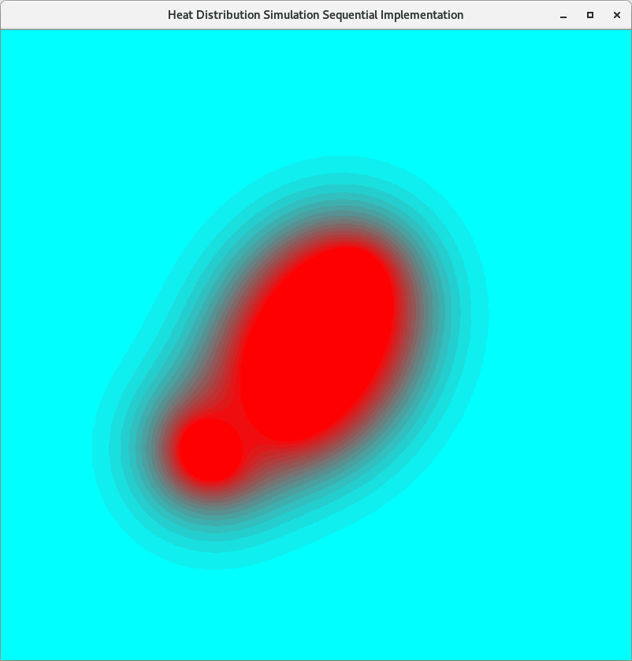

# CSC4005 Project 4 Template

<br/>

# Example Run

Command:

```bash
make seqg
./seqg 1000
```

Output:



<br/>
<br/>
<br/>

# Physics

We have some physics variable declared in `headers/physics.h`:

```c++
#define threshold 0.00001f
#define fire_temp 90.0f
#define wall_temp 0.0f
#define fire_size 100
#define resolution 800
```

`threshold` is a measure of convergence, when the difference between successive frames is smaller than `threshold`, the simulation should terminate.

`fire_temp` is the temperature of fire.

`wall_temp` is the temperature of wall.

`fire_size` is the size of fire.

`resolution` is the number of pixels of x and y axis. Lower resolution leads to faster rendering speed. If you prefer smooth contours, you can use `resolution = 800`. If you prefer faster rendering speed, you can use `resolution = 200`. When you submit your demo video, you can use `resolution = 800` for better visualization.

You may need to modify them to better visualize your result.

<br/>
<br/>
<br/>


# About CUDA Emulator

We have prepared a CUDA Emulator Virtual Machine for you. You can **emulate CUDA or CUDA-GUI program** on your personal computer (**without Nvidia GPU!**).

For details, please see this: 

`CSC4005_2022Fall_Demo/docs/CUDA Emulator Manual.md` 

or 

https://github.com/bokesyo/CSC4005_2022Fall_Demo/blob/main/docs/CUDA%20Emulator%20Manual.md.

(equivalent).


<br/>
<br/>
<br/>


# Compile & Run

## Compile

Sequential (command line application):

```bash
g++ ./src/sequential.cpp -o seq -O2 -std=c++11
```

Sequential (GUI application):

```bash
g++ ./src/sequential.cpp -o seqg -I/usr/include -L/usr/local/lib -L/usr/lib -lglut -lGLU -lGL -lm -DGUI -O2 -std=c++11
```

MPI (command line application):

```bash
mpic++ ./src/mpi.cpp -o mpi -std=c++11
```

MPI (GUI application):

```bash
mpic++ ./src/mpi.cpp -o mpig -I/usr/include -L/usr/local/lib -L/usr/lib -lglut -lGLU -lGL -lm -DGUI -std=c++11
```

Pthread (command line application):

```bash
g++ ./src/pthread.cpp -o pthread -lpthread -O2 -std=c++11
```

Pthread (GUI application):

```bash
g++ ./src/pthread.cpp -o pthreadg -I/usr/include -L/usr/local/lib -L/usr/lib -lglut -lGLU -lGL -lm -lpthread -DGUI -O2 -std=c++11
```

CUDA (command line application): notice that `nvcc` is not available on VM, please use cluster.

```bash
nvcc ./src/cuda.cu -o cuda -O2 --std=c++11
```

CUDA (GUI application): notice that `nvcc` is not available on VM, please use cluster.

```bash
nvcc ./src/cuda.cu -o cudag -I/usr/include -L/usr/local/lib -L/usr/lib -lglut -lGLU -lGL -lm -O2 -DGUI --std=c++11
```


OpenMP (command line application):

```bash
g++ ./src/openmp.cpp -o openmp -fopenmp -O2 -std=c++11
```

OpenMP (GUI application):

```bash
g++ ./src/openmp.cpp -o openmpg -fopenmp -I/usr/include -L/usr/local/lib -L/usr/lib -lglut -lGLU -lGL -lm -O2 -DGUI -std=c++11
```


## Run

Sequential (command line mode):

```bash
./seq $problem_size
```

Sequential (GUI mode): please run this on VM (with GUI desktop).

```bash
./seqg $problem_size
```

MPI (command line mode):

```bash
mpirun -np $n_processes ./mpi $problem_size
```

MPI (GUI mode): please run this on VM (with GUI desktop).

```bash
mpirun -np $n_processes ./mpig $problem_size
```


Pthread (command line mode):

```bash
./pthread $problem_size $n_threads
```

Pthread (GUI mode): please run this on VM (with GUI desktop).

```bash
./pthreadg $problem_size $n_threads
```

CUDA (command line mode): for VM users, please run this on cluster.

```bash
./cuda $problem_size $n_iterations
```

CUDA (GUI mode): if you have both nvcc and GUI desktop, you can try this.

```bash
./cuda $problem_size $n_iterations
```


OpenMP (command line mode):

```bash
openmp $problem_size $n_omp_threads
```

OpenMP (GUI mode):

```bash
openmpg $problem_size $n_omp_threads
```

<br/>
<br/>
<br/>

# Makefile

Makefile helps you simplify compilation command.

```bash
make $command
```

where `command` is one of `seq, seqg, mpi, mpig, pthread, pthreadg, cuda, cudag, openmp, openmpg`.


When you need to recompile, please first run `make clean`!


<br/>
<br/>
<br/>


# Sbatch script

For example, we want to use 20 cores for experiment.

## MPI

For MPI program, you can use

```sh
#!/bin/bash
#SBATCH --job-name=your_job_name # Job name
#SBATCH --nodes=1                    # Run all processes on a single node	
#SBATCH --ntasks=20                   # number of processes = 20
#SBATCH --cpus-per-task=1      # Number of CPU cores allocated to each process (please use 1 here, in comparison with pthread)
#SBATCH --partition=Project            # Partition name: Project or Debug (Debug is default)

cd /nfsmnt/119010355/CSC4005_2022Fall_Demo/project4_template/
mpirun -np 4 ./mpi 1000 100
mpirun -np 20 ./mpi 1000 100
mpirun -np 40 ./mpi 1000 100


```

## Pthread

For pthread program, you can use

```sh
#!/bin/bash
#SBATCH --job-name=your_job_name # Job name
#SBATCH --nodes=1                    # Run all processes on a single node	
#SBATCH --ntasks=1                   # number of processes = 1 
#SBATCH --cpus-per-task=20      # Number of CPU cores allocated to each process
#SBATCH --partition=Project            # Partition name: Project or Debug (Debug is default)

cd /nfsmnt/119010355/CSC4005_2022Fall_Demo/project4_template/
./pthread 1000 100 4
./pthread 1000 100 20
./pthread 1000 100 40
./pthread 1000 100 80
./pthread 1000 100 120
./pthread 1000 100 200
...

```

here you can create as many threads as you want while the number of cpu cores are fixed.

For a pthread program, we notice that sbatch script contains

```sh
#SBATCH --ntasks=1                   # number of processes = 1 
#SBATCH --cpus-per-task=20      # Number of CPU cores allocated to each process
```

the meaning of these two lines are: only one process is started, it can create many threads, where threads are distributed to all available 20 cpu cores by OS. 


## CUDA


For CUDA program, you can use

```bash
#!/bin/bash

#SBATCH --job-name CSC3150CUDADemo  ## Job name
#SBATCH --gres=gpu:1                ## Number of GPUs required for job execution.
#SBATCH --output result.out         ## filename of the output
#SBATCH --partition=Project           ## the partitions to run in (Debug or Project)
#SBATCH --ntasks=1                  ## number of tasks (analyses) to run
#SBATCH --gpus-per-task=1           ## number of gpus per task
#SBATCH --time=0-00:02:00           ## time for analysis (day-hour:min:sec)

## Compile the cuda script using the nvcc compiler
## You can compile your codes out of the script and simply srun the executable file.
cd /nfsmnt/119010355/CSC4005_2022Fall_Demo/project4_template/
## Run the script
srun ./cuda 10000 100
```


## OpenMP

For OpenMP program, you can use

```bash
#!/bin/bash

#SBATCH --job-name job_name  ## Job name
#SBATCH --output result.out         ## filename of the output
#SBATCH --partition=Project           ## the partitions to run in (Debug or Project)
#SBATCH --ntasks=1                  ## number of tasks (analyses) to run
#SBATCH --gpus-per-task=1           ## number of gpus per task
#SBATCH --time=0-00:02:00           ## time for analysis (day-hour:min:sec)

## Compile the cuda script using the nvcc compiler
## You can compile your codes out of the script and simply srun the executable file.
cd /nfsmnt/119010355/CSC4005_2022Fall_Demo/project4_template/
## Run the script
./openmp 10000 100 20
```


To submit your job, use

```sh
sbatch xxx.sh
```

<br/>
<br/>

# Salloc

If you want to run your program using interactive mode, use

## MPI

For MPI porgram, we have learned before:

```sh
salloc -n20 -c1 # -c1 can be omitted.
mpirun -np 20 ./mpi 1000 1000 100
```

## Pthread
For pthread program,

```sh
salloc -n1 -c20 -p Project # we have only 1 process, 20 is the number of cores allocated per process. 
srun ./pthread 1000 1000 100 20 # 20 is the number of threads.
```

## CUDA

For CUDA program,

```bash
salloc -n1 -c1 --gres=gpu:1 -p Project # require 1 gpu
srun ./cuda 10000 1000
```


## OpenMP

For openMP program,

```bash
salloc -n1 -c20 -p Project # require 1 gpu
srun ./openmp 10000 1000 20
```


<br/>
<br/>
<br/>


# Changelog

1. Added CUDA version (Nov 24, 2022).

2. Added MPI version (Nov 25, 2022).

3. Changed default resolution from 200 to 800 (Nov 25, 2022).

4. Changed graphic API from GLVertex to glDrawPixels, improving rendering speed (Nov 25, 2022).

5. Changed computation of elapsed time (Nov 25, 2022).


If you have downloaded this template before 6:00 pm, Nov 25, 2022, please try to use the latest version. 

<br/>
<br/>
<br/>


# Authors

Bokai Xu

Thank @Peilin Li, @Yangyang Peng, and @SydianAndrewChen for giving valuable suggestions to this series of templates.